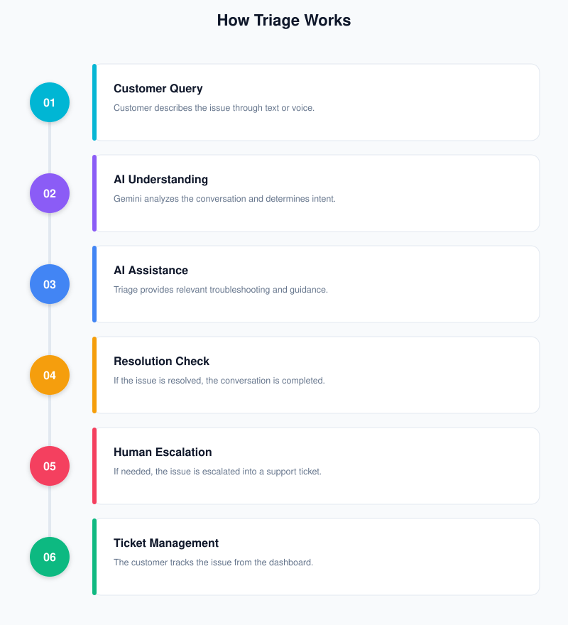
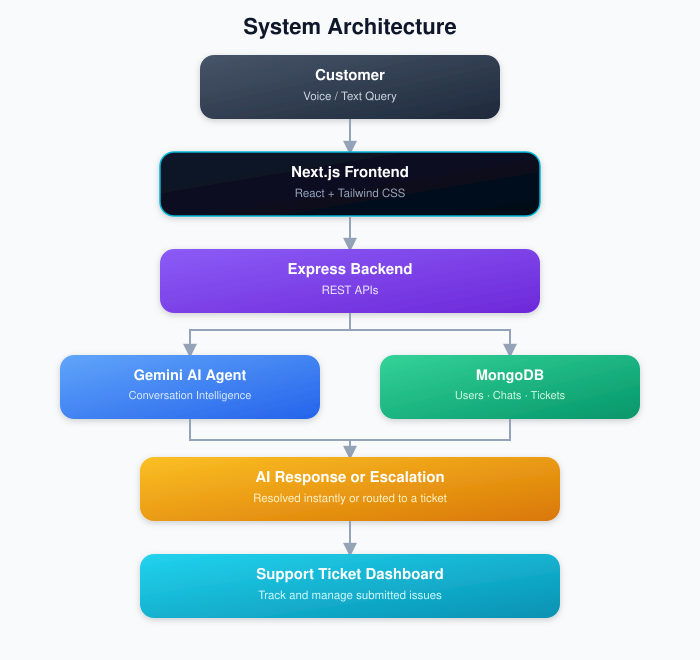
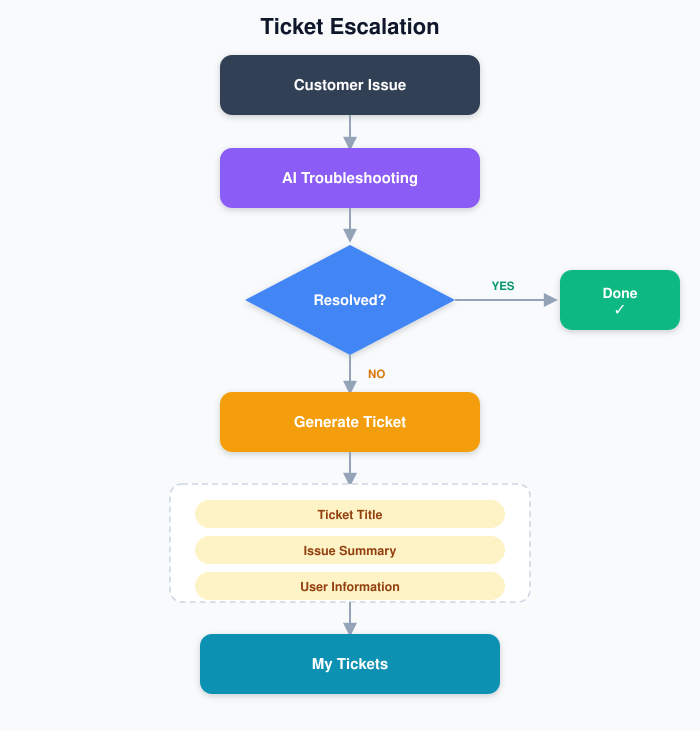

# Triage — AI Customer Support Platform

<div align="center">


<br><br>

### Voice & Text AI Support with Intelligent Ticket Escalation

Triage is a full-stack AI customer support platform that helps businesses automate customer conversations, resolve common issues instantly, and escalate unresolved cases to support tickets.

<br>

</div>

---

## Overview

**Triage** is a full-stack AI-powered customer support platform built around conversational AI.

Customers can interact with Triage through **text or voice**, explain their issue naturally, and receive AI-powered assistance. Instead of simply returning predefined FAQ responses, the AI can understand the conversation, ask follow-up questions, and guide the customer through troubleshooting.

When an issue cannot be resolved automatically, Triage can **escalate the conversation into a support ticket**, generating a relevant ticket title and summary so the issue can be tracked by the support system.

The project combines **AI integration, full-stack development, authentication, database management, voice interaction, and workflow automation** into one production-style application.

---

## Key Features

<div align="center">

|     | Feature                     | Description                                                                          |
| :-: | --------------------------- | ------------------------------------------------------------------------------------ |
|  💬 | **AI Customer Support**     | Conversational AI powered by Google Gemini for natural customer interactions.        |
| 🎙️ | **Voice Support**           | Voice input with browser speech recognition and AI voice responses using Kokoro TTS. |
|  🔐 | **Authentication**          | JWT-based authentication with bcrypt password hashing.                               |
|  🧠 | **Conversation Context**    | Maintains conversation context during support interactions.                          |
|  🎫 | **Smart Ticket Escalation** | Creates support tickets when an issue requires human assistance.                     |
|  📊 | **Dashboard**               | Centralized interface for accessing support activity and submitted tickets.          |
| 🗂️ | **Ticket Management**       | Create, view, update, and delete support tickets.                                    |
|  ⚡  | **Instant Support**         | AI assistance is available without requiring a human agent for every request.        |

</div>

---

# Product Preview

## Landing Page

### Hero & Navigation

<p align="center">
  
</p>

### How It Works

<p align="center">
  
</p>

### FAQ

<p align="center">
  
</p>

---

## Authentication

Triage provides a dedicated authentication flow for users.

<div align="center">

<table>
<tr>
<td align="center">

<b>Register</b>

<br><br>


</td>

<td align="center">

<b>Login</b>

<br><br>


</td>
</tr>
</table>

</div>

---

## Ticket Management

When AI assistance is not enough, customers can escalate their issue into a support ticket.

### Create Ticket

<p align="center">
  
</p>

### My Tickets

<p align="center">
  
</p>

### Ticket Management

<p align="center">
  
</p>

---

# How Triage Works

<div align="center">



</div>

---

# System Architecture

<div align="center">



</div>
---

# Voice Support

Triage supports voice-based interaction in addition to traditional text chat.

### Voice Input

Customer speech is captured through browser-based speech recognition and converted into text for the AI agent.

### AI Processing

The resulting query is sent through the same support workflow used by text conversations.

### Voice Output

AI responses can be converted into speech using **Kokoro.js**, providing a more natural voice-support experience directly in the browser.

> Voice functionality is optional and can be enabled when required, while text-based support remains available as the primary interaction mode.

---

# Authentication Flow

```text
                 ┌───────────────┐
                 │    Register   │
                 └───────┬───────┘
                         │
                         ▼
                ┌─────────────────┐
                │ Password Hashing│
                │     bcrypt      │
                └───────┬─────────┘
                        │
                        ▼
                ┌─────────────────┐
                │     MongoDB     │
                │   User Record   │
                └───────┬─────────┘
                        │
                        ▼
                ┌─────────────────┐
                │      Login      │
                └───────┬─────────┘
                        │
                        ▼
                ┌─────────────────┐
                │   JWT Token     │
                └───────┬─────────┘
                        │
                        ▼
                Protected API Routes
```

---

# Ticket Escalation

<div align="center">



</div>
---

# Tech Stack

<div align="center">

### Frontend


<br>


### Backend


### AI & Security


### Development & Deployment


</div>

---

# Project Structure

```text
Automated-AI-Customer-Support-Platform/
│
├── src/
│   ├── app/
│   │   ├── page.js
│   │   ├── login/
│   │   ├── register/
│   │   ├── chat/
│   │   └── dashboard/
│   │
│   ├── components/
│   │   ├── landing/
│   │   ├── layout/
│   │   └── common/
│   │
│   ├── data/
│   │   ├── features.js
│   │   ├── faq.js
│   │   └── workflow.js
│   │
│   ├── lib/
│   │   └── kokoro.js
│   │
│   └── constants/
│
├── backend/
│   ├── controllers/
│   │   ├── authController.js
│   │   ├── chatController.js
│   │   └── ticketController.js
│   │
│   ├── models/
│   │   ├── User.js
│   │   ├── Conversation.js
│   │   └── Ticket.js
│   │
│   ├── routes/
│   │   ├── authRoutes.js
│   │   ├── chatRoutes.js
│   │   └── ticketRoutes.js
│   │
│   ├── middleware/
│   │   └── authMiddleware.js
│   │
│   └── server.js
│
├── public/
│   ├── screenshots/
│   └── assets/
│
├── package.json
├── next.config.mjs
├── jsconfig.json
└── README.md
```

---

# API Overview

|  Method  | Endpoint                  | Description                         | Auth |
| :------: | ------------------------- | ----------------------------------- | :--: |
|  `POST`  | `/api/auth/register`      | Register a new user                 |  No  |
|  `POST`  | `/api/auth/login`         | Authenticate user and receive JWT   |  No  |
|   `GET`  | `/api/auth/profile`       | Retrieve authenticated user profile |  Yes |
|  `POST`  | `/api/chat`               | Send a message to the AI agent      |  Yes |
|   `GET`  | `/api/chat/history`       | Retrieve conversation history       |  Yes |
|  `POST`  | `/api/tickets/create`     | Create a support ticket             |  Yes |
|   `GET`  | `/api/tickets/my-tickets` | Retrieve user's tickets             |  Yes |
|   `PUT`  | `/api/tickets/:id`        | Update a ticket                     |  Yes |
| `DELETE` | `/api/tickets/:id`        | Delete a ticket                     |  Yes |

---

# Security

Triage uses multiple mechanisms to protect user data and application access.

* JWT-based authentication
* bcrypt password hashing
* Protected API routes
* User-specific ticket access
* Environment variables for API keys and database credentials
* `.env` excluded through `.gitignore`
* MongoDB persistence for authenticated application data

> Never expose your Gemini API key, MongoDB connection string, JWT secret, or other credentials in the repository.

---

# Installation & Setup

## Prerequisites

* Node.js 18+
* MongoDB / MongoDB Atlas
* Google Gemini API key
* Git

## Clone the Repository

```bash
git clone https://github.com/priyakourav/Automated-AI-Customer-Support-Platform.git

cd Automated-AI-Customer-Support-Platform
```

## Install Frontend Dependencies

```bash
npm install
```

## Configure Backend

```bash
cd backend
npm install
```

Create:

```text
backend/.env
```

Add:

```env
PORT=5000
MONGO_URI=your_mongodb_connection_string
JWT_SECRET=your_jwt_secret
GEMINI_API_KEY=your_gemini_api_key
```

## Start Backend

```bash
npm run dev
```

Backend:

```text
http://localhost:5000
```

## Start Frontend

Open another terminal:

```bash
cd ..
npm run dev
```

Frontend:

```text
http://localhost:3000
```

---

# Current Capabilities

<div align="center">

| Capability              | Status |
| :---------------------- | :----: |
| AI Text Support         |    ✓   |
| Voice Input             |    ✓   |
| AI Voice Output         |    ✓   |
| Gemini AI Integration   |    ✓   |
| User Registration       |    ✓   |
| User Login              |    ✓   |
| JWT Authentication      |    ✓   |
| Conversation Handling   |    ✓   |
| Ticket Creation         |    ✓   |
| Ticket Management       |    ✓   |
| User Dashboard          |    ✓   |
| MongoDB Persistence     |    ✓   |
| Responsive Landing Page |    ✓   |

</div>

---

# Future Improvements

* [ ] Admin / support-agent dashboard
* [ ] Real-time agent-to-customer communication
* [ ] Advanced ticket assignment
* [ ] Multi-language AI and voice support
* [ ] Support analytics and reporting
* [ ] Knowledge-base integration
* [ ] Email notifications for ticket updates
* [ ] WebSocket-based real-time updates

---

# Why I Built Triage

Triage was built to explore how AI can be integrated into a **complete customer-support workflow**, rather than using an LLM as a standalone chatbot.

The project brings together:

```text
AI
+
Full-Stack Development
+
Authentication
+
Database Management
+
Voice Interaction
+
Workflow Automation
+
Ticket Management
```

The goal was to build a practical, production-style application that demonstrates how conversational AI can handle routine support requests while providing a structured path to human intervention.

---

# Author

<div align="center">

### Priya Kourav

B.Tech — Computer Science & Engineering (AI & ML)

<br>

<a href="https://github.com/priyakourav">
  
</a>

</div>

---

# License

This project is licensed under the **ISC License**.

---

<div align="center">

### Triage

**AI-powered support that helps businesses respond faster.**

<br>

If you found the project interesting, consider giving the repository a ⭐

</div>
